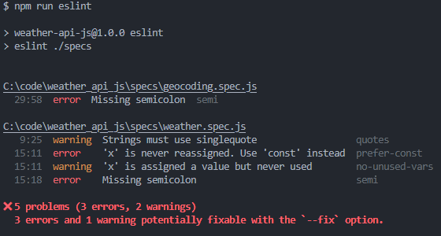
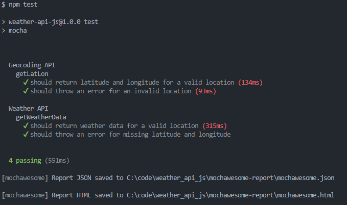
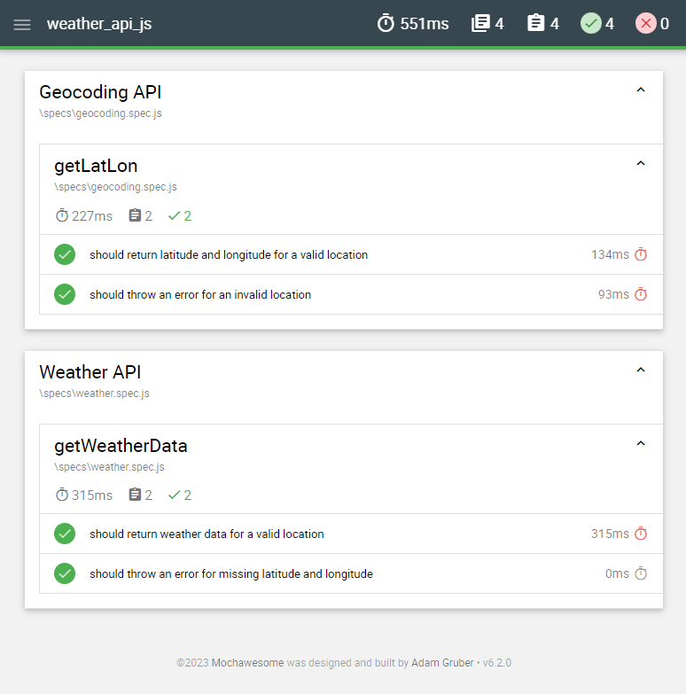

# weather_api_js [](https://github.com/oscarcenteno/weather_api_js/actions/workflows/nodejs.yml)

Sample implementation of API tests for Weather API including CI test runs with GitHub Actions.

## Test approach

Sample tests for APIs focus on checking that specific endpoints provide responses.

As these tests use the Production API, we know that the APIs may return different results depending on the weather, so the assertions will be focused on making sure that responses format comply to expectations. Also, it will verify some edge cases inc ase API parameters are not provided or Invalid city names are used.

This project does not test other single-call endpoints given the limited time, but it provides a configurable development environment and a running CI workflow.

## Prerequisites

- NodeJS
- Git
- Visual Studio Code
- API_KEY for https://openweathermap.org/ API

## Setup

NodeJS and NPM are requirements for running this testing framework. Given that, run the following command to install dependencies:

```bash
npm install
```

For development purposes, recommended IDE is VSCode, as this workspace incluses some suggested settings for code formatting.

Additionally an API key is required to be able to call the Production API server. "API_KEY" should be provided in a .env file or passed as environment variable when running the tests as a terminal command.

## Code formatting

Source code format is checked with ESLint. Run next command to check for linting problems:

```bash
npm run lint
```

This is a sample report with errors:



Code style is enforced in CI runs too. 

## Running tests

Next command runs Mocha test framework with parameters specified in .mocharc.js file.

```bash
npm test
```

## Reporting

Reports will be generated into "mochawesome-report" folder.

Sample images are provided in "images" folder for Console reporter and mochawesome reports:

### Console Report



### Mochawesome Report



## REST API Client

Folder /specs/requests.http contains REST API requests to the external server http://api.openweathermap.org, and it is configurable to be able to use other servers if production environment is to be stubbed for testing purposes.

Sample production responses are provided in /specs/production_responses folder so a stub server could be setup.

APIKey should be configured in .vscode/settings.json file.

## GitHub Actions

GitHub Actions worklow is used to run tests and report results for this repository. API_KEY is stored as a repository secret for automated CI runs on every commit.